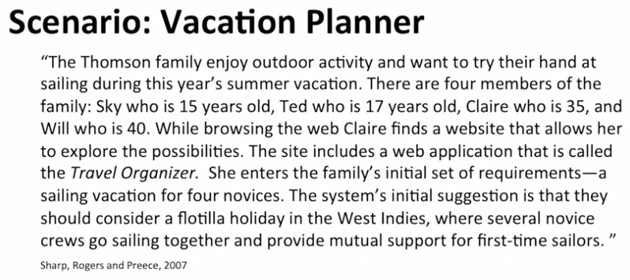
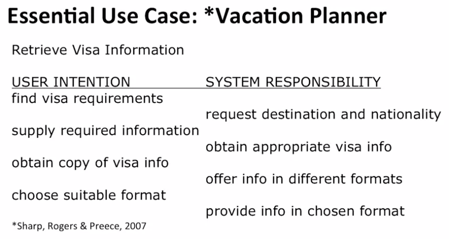
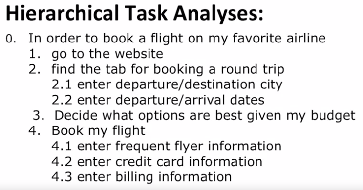
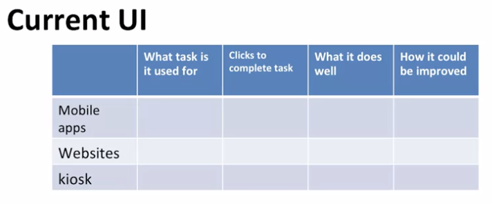
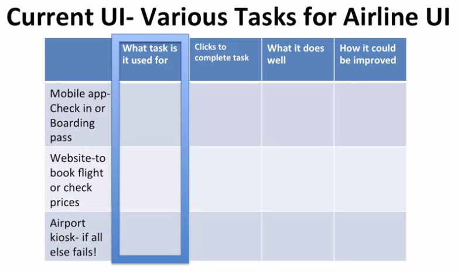
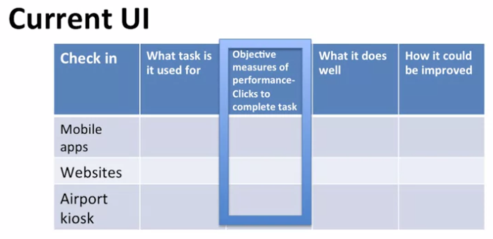
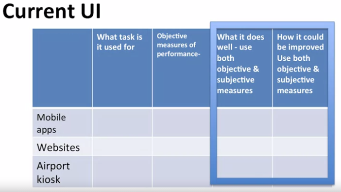

## Presenting Task Findings

Welcome to User Experience Design.

In previous lessons, I've mentioned that a main pitfall of requirements gathering is that designers start designing alternatives when they do not completely understand the task, the user, or how the user currently accomplishes the task. In other words, they get ahead of themselves, they start designing without user data.

- Main pitfall of Requirements Gathering (RG)
  - designers start designing  
    alternatives when they 
    do not completely 
    understand 
    the task, the user, or how 
    the User currently 
    accomplishes the task

Let's imagine that you've averted the pitfall, you are well-versed on techniques to understand how the user is accomplishing the task.

- Pitfall Averted!
  - Techniques to understand 
    how the User is currently 
    accomplishing the task
  - Collected data via 
    naturalistic observation, 
    survey, focus group, 
    interview

Further, you've conducted a series of naturalistic observations, surveys, focus groups, and interviews that have given you a clear understanding of what the user currently does.

Now you're in a position to present your requirement gathering findings via a series of different techniques. These include scenarios, essential use case scenarios, hierarchical task analyses, and current UI critique.

- Techniques to present RG findings
  - About the Task (beyond descriptive statistics)
    - Scenarios
    - Essential Use Case
    - Hierarchical Task Analysis
    - Current UI Critique

These techniques describe the data beyond descriptive statistics. I mean, we might present this in lieu or in addition to quantitative summaries of the data Here I assume that the qualitative and quantitative data have been analyzed appropriately. This is another critical aspect of the designer training process, but one that is beyond the scope of this course.

- Critical Note:
  - The qualitative and quantitative data are analyzed appropriately

#### Scenarios
The first technique I want to introduce you to is a scenario. Scenarios provide a narrative of both the qualitative and quantitative data. It allows us an opportunity to convey the richness of the data set we collected in a storyline that highlights all of the important aspects about the task and how it is currently accomplished. In other words, it allows the task to come to life, beyond the graphs and tables that present cold hard statistics.

Here we have a scenario presented by Sharp et al of a vacation planner. Read it through once and try to identify what data could have been collected via naturalistic observation, survey, focus group, and interviews.

You can also make a list of questions that the designer asks in order to get the narrative that we see here.

#### Essential Use Case
A scenario allows us to understand how a system is used by the user. An Essential Use Case scenario, on the other hand, allows us to understand the user's activities, and what the system requirements are.

They essentially use case scenario has three important elements.

First it names the user's goals. What aspect of X this captures. In this case, the user may want to know if she will need a Visa to go to the West Indies.

Second, the user intention. The series of steps she needs to enter into the system.

And third, the system's responsibilities. What the system must do after each step completed by the user. So here we have first The user wants to find Visa requirements then the system request destination and nationality. Once the user supplies the required information the system will obtain appropriate Visa information and so on.

1. Names the User's Goals - Is a Visa required ???
2. The User Intention - The series of steps she needs to enter into the system
3. System's Responsibilities - What the system must do after each step completed by the user i.e. if the Visa is required then request the destination and nationality

#### Hierarchical Task analyses
Hierarchical Task analyses. Is the most common task analysis technique. It allows us to consider how users are currently completing a task.

Here it is key to focus on observable actions.

Here is a hierarchical task analyses in its simplest form, an outline. Notice that I start with the goal. And number each of the major steps towards meeting my goal. Some of the steps have substeps that I must fulfill before going on the next step. This technique is all about the users goals. Unlike the essential used case. We didn't considered what the airline system needs to do at ech of the users steps Also notice that I didn't include system interaction tasks like using a scroll bar. This is just about the user and the steps to accomplish the goals.

#### Current UI Critique
So far, I've presented ways that the task is accomplished by the user or the system. It is also important to consider user interfaces or UIs and how they are failing to meet the needs of the user. Here, the current UI might be an app or in the example I just present it. It might be a website or it might even be a set of paper forms that the user currently uses.

In conducting a UI critique you would want to actually interact with the UI. Take it for a spin so to speak.

If each UI for each UI. You would want to identify the task or task of the users uses it for. For example, I only use mobile app for the boarding pass function.

I use the airline website for booking flights or checking prices with competitors or checking in And I'll only use the airport kiosk in a situation where I forget to check in online. So that's the worst case scenario.

Next, you want to have an objective measure of how long it takes to complete the task. In this example I chose a number of clicks it would take me to either use the app, use the website, or go through the kiosk to accomplish a task.

You would then evaluate what it does well and how it could be improved. Here you could use either objective or subjective measures.

And systematically analyzing the interfaces that are currently being used. You make sure that you articulate where the needs are being met and what you can do to improve the user experience.

As designers, we want to improve the user experience but this requires that we know what the user is already enjoying And build on that.

This concludes our lessons on techniques for presenting our requirement gathering findings.
