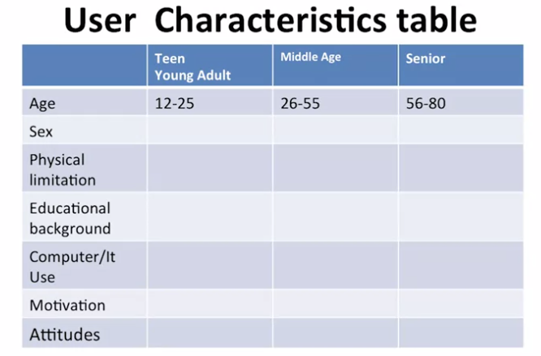
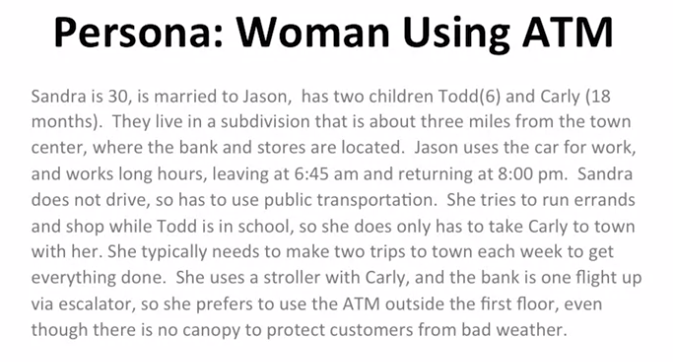

## User Results

Welcome to User Experience Design. Today we will explore how to present the findings we gathered about the user during the requirements gathering process.

Interaction design is a cycle. We've spent a good deal of time learning various requirement gathering techniques to learn about the problem space.

We've discussed that as designers we provide the best user experience when we acknowledge that the user uses interfaces to accomplish tasks. The first step of the design process is to understand how users are completing the task now.

We have just finished discussing the techniques that allow us to discover what the user is doing now.

Now we will focus on techniques that will allow us to present, or in other words summarize our results.

- Designer Techniques
  - Discover what the User is doing now
    - Naturalistic observation
    - Survey
    - Focus Group
    - Interview
  - Present our requirements gathering (RG) findings

**Critical Note :**
- Here we'll assume that the qualitative and quantitative data has been analyzed in the appropriate manner
 
This is another important aspect of the designer training process.

In this lesson, we will discuss techniques for representing what we discover about the user. These include : 

- Techniques to communicate RG findings
  - About the User
    - Descriptive statistics
    - User characteristic tables
    - Persona

Descriptive statistic allows us to summarize quantitative information. This includes :

- Techniques to communicate RG findings
  - About the User
    - Descriptive statistics
      - Range
      - Mean
      - Median of a data set

- The range tells us what the minimum and the maximum number were for a set of numbers. 
- The mean allows us to know the average score for a certain set. 
- While the median gives us the mid-score for a set of numbers. 

Let's say that we collect the data from five participants on how many times they download information daily.

The range was 3 to 30, that means one person said they downloaded three different content types. While there was one that downloaded 30 different items a day. The mean was 10.2 and and the median was 5. The median is important because it is less effected by extreme scores. So even though there was a person that downloaded 30 items and one that only downloaded three. The median gives us important information about the distribution of those five data points. 

User Characteristics table allow us to highlight important aspects about what we learn via the requirement gathering process. It provides a tabular summary of our findings.

- Techniques to communicate RG findings
  - About the User
    - User Characteristics tables

In this table we see that we can include both quantitative and qualitative information. Quantitative information includes basic demographics, for example, age, sex and education.

But also a summary of qualitative information, such as the user's computer experience or their motivation and attitudes. Thus we provide a quick summary of all of our data in a simple form factor.

The persona provides a narrative of both the qualitative and quantitative data.

It allows us an opportunity to convey the richness of the data set we collected in the story line. That highlights all of the important data we collected about the user. In other words, it allows the user and her needs to come to life.

- Techniques to communicate RG findings
  - About the User
    - Personas

Here we have a persona for a woman that uses the ATM.

Take a minute to read it.

As you go through it try to identify what data could have been collected via naturalistic observation, surveys, focus groups or interviews. Again, the important thing about the techniques I've told you is that we're getting a summary of all of the data.

You can also make a list of questions that the designer asked in order to get the narrative that we see here for the woman using the ATM.

In this lesson, we discussed techniques for representing what we discovered about the user. These included descriptive statistics, user characteristic tables and personas i.e.

- Techniques to communicate RG findings
  - About the User
    - Descriptive statistics
    - User characteristic tables
    - Persona
