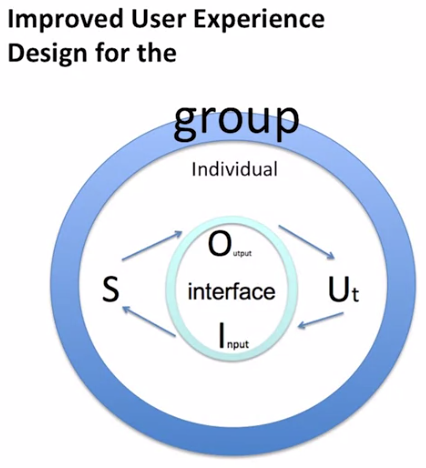

## Review of Design Goals

Welcome to Introduction to User Experience Design. Today we start a new module where we will consider how to design alternatives to improve the user experience. In this lesson we will review design goals.

First, I want to remind you about the core concept that drives user experience design. That is, that users use interface to accomplish a task. The premise is that the best interface can only be designed if we understand the user and the task they want to accomplish.

- Core concept that drives user experience design
  - Users use interfaces to accomplish a task

In the previous module, you learned about the importance of understanding the user and her current practices. So now we imagine that we've concluded the requirement gathering phase. You now have a deep understanding of the user. **You understand the who, what, when, where of the user's goals.** In other words, the information you collected in the requirements gathering phase has allowed you to understand the problem space. What it is that the user needs.

In this module we consider how to use the information from the requirements gathering phase to develop a set of alternative designs to meet the needs you've discovered.

We originally defined design as the development of a novel creation to meet some needs.

The goal of the novel designs we create is to do a better job of meeting the needs of the user than the existing designs.

Here I want to underscore that the goal of design is not novelty for its own sake, it's novelty and the service of improving the user experience.

As we think about the user's needs, it's also important to remember that they do not exist in a vacuum, but rather in an ecosystem. Where the individual user interacts with the interface, and in turn the user may interact via the system with another group of users, and all of these users coexist in a society with a set of values. In other words, the design alternatives we develope impact the entire ecosystem. Next, I will go through each of these levels and consider what it means to improve the user experience via novel design.

I encourage you to review module one lesson one if you need to brush up on the definitions of the concepts that are in this figure.

Designing novel interfaces is all about finding improved ways to mediate how the user accomplishes a task. It may require that we create a whole new system. Or it may be that we simply design novel inputs and outputs. Consider an instance when you bought a new model of your favorite X.

 
What changed or improved in the design?

One example that I can bring to mind is when I bought a new cell phone model. The biggest improvement as far as I was concerned was that the texting interface was different. The company changed the color scheme so that now there was greater contrast between the text and the background. They also allowed me to increase the size of the font.

While there was no major change in a way that I did the task or the core goals of the task I was trying to complete, these small changes amounted to an improved user experience for me.

 
This was improved design focused on the individual user. Considerations when designing at the level, at this level include keeping in mind user characteristics. These include the user's age, education level, comfort with technology. Physical constraints and capabilities. It's hard to believe that my original phone didn't have a way to increase the font size. This may have been that the user characteristics of the designer were not the same as those of the users, or the gambit of users that came to use this cell phone.

In reviewing the result from the requirement gathering phase, what can you do to improve the individual's experience?

How can you change the design of an existing interface to improve interactions among a group of users? Consider a system that you currently use that allows a group interaction. A common example is a social media application. For example, Facebook. How did you feel the last time that they updated the interface?

Sometimes improving the individual's experience leads to designing a group interface. For example, Weight Watchers is a program designed to help people learn healthy habits and thereby lose weight. In their last revamping of the Weight Watchers app they added a group function. Now Weight Watchers members have a social media component called Connect, that allows the users to share their weight loss journey.

 
The design ecosystem includes the social level. Here the idea is that there are cultural issues that impact the use or adoption of a system. As designers we need to be aware of cultural values related to the task that the user engages in, and design with those issues in mind.

I recently read a really fascinating article, where the team was trying to develop a system to remind users about their medication, or about taking their medication. This seems like a pretty straightforward task except that in this case the illness had a lot of negative social stigma associated with it. Thus, the interface had to be designed with this in mind. For example, there was nothing in the interface that signaled what the condition was that the individual had. This was to protect the privacy of the user.

I'll end this lesson by reminding you that the goal of user experience design is to build interfaces or artifacts that are useful and usable. By useful that it allows the user or users to complete a task. By usable I mean that the user can accomplish the task via the interface in an effective, efficient, and satisfying manner.

In this lesson we introduce concepts that are essential to keep in mind when developing design alternatives. If we keep these in mind then we will be able to develop design alternative to improve the user experience.

This concludes our first lesson in the alternative design phase of the user interface design cycle.
